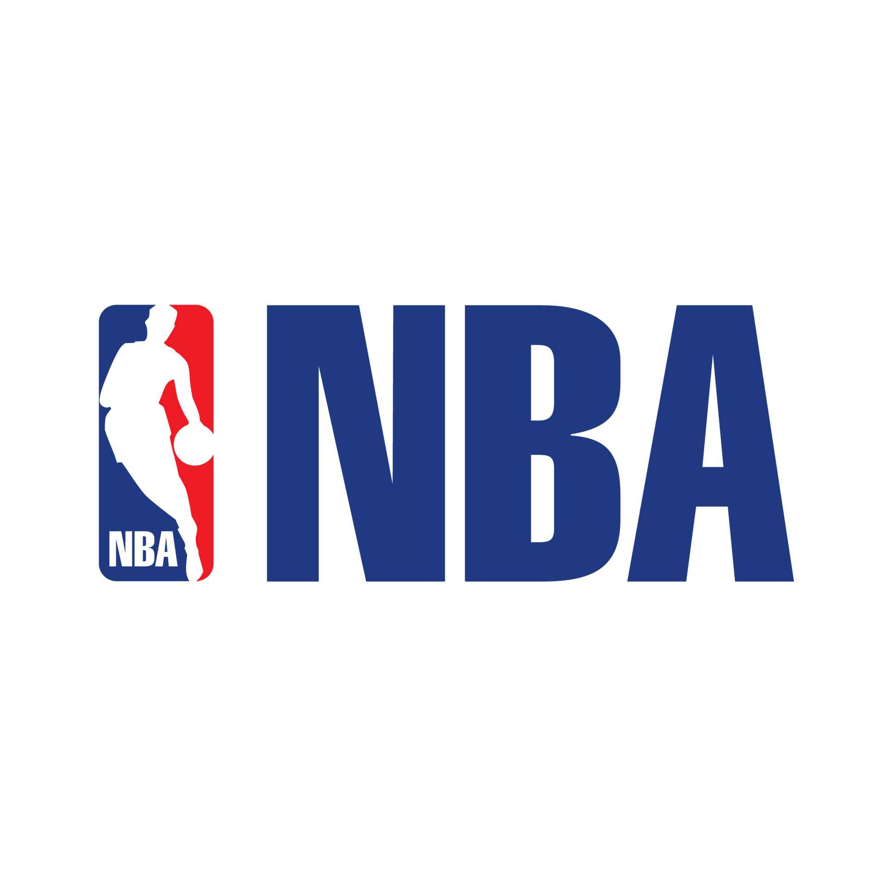

<div id="top">

<!-- HEADER STYLE: CLASSIC -->
<div align="center">



# 🏀 NBA Analytics – Streamlit WebApp

<em>Advanced statistical analysis of Dunkest NBA data from 2018 to 2025</em>


</div>

---

## 📚 Table of Contents

- [Overview](#overview)
- [Features](#features)
- [Project Structure](#project-structure)
- [Getting Started](#getting-started)
  - [Prerequisites](#prerequisites)
  - [Installation](#installation)
  - [Usage](#usage)
- [Contributing](#contributing)
- [License](#license)
- [Authors](#authors)
- [Acknowledgments](#acknowledgments)

---

## 🧠 Overview

**NBA Analytics** is an interactive web app built with [Streamlit](https://streamlit.io) that allows users to explore and analyze NBA player statistics over multiple seasons. It supports dynamic queries, visual insights, and historical performance analysis.

Data is stored in a MySQL database managed locally via XAMPP. Once the database is created through phpMyAdmin, you can import stats tables using the `.sql` files in the `sql-stats-tables` folder.

---

## ✨ Features

- 🔐 Multi-user login with Streamlit Authenticator
- 🧮 Real-time average and stat filtering per season
- 👤 Individual player analysis over 7 seasons
- 🧠 Weighted PDK (fantasy score) historical evaluation
- 🔍 Dynamic player search and stat filters
- 🗃️ MySQL integration and query execution
- 📈 Interactive Plotly charts

---

## 🗂️ Project Structure

```sh
└── /
    ├── auth
    │   └── authenticator.py
    ├── images
    │   └── nbalogo.png
    ├── utils
    │   └── db.py
    ├── app.py
    ├── tabs.py
    ├── config.example.yaml
    ├── .env.example
    ├── requirements.txt
    └── sql-stats-tables
        └── season_stats.sql     
```

---

## 🚀 Getting Started

### 📦 Prerequisites

- Python 3.8+
- Pip
- MySQL + XAMPP (or Docker)

### 🛠️ Installation

1. Clone the repository:

```sh
git clone https://github.com/git-nikke/webapp-nba-stats.git
cd webapp-nba-stats
```

2. (Optional) Create and activate a virtual environment:

```sh
python -m venv .venv
.venv\Scripts\activate  # Windows
source .venv/bin/activate  # macOS/Linux
```

3. Install the dependencies:

```sh
pip install -r requirements.txt
```

4. Create the `.env` and `config.yaml` files:

```sh
cp .env.example .env
cp config.example.yaml config.yaml
```

> ⚠️ Edit the above files to include your database connection and login credentials.

---

### ▶️ Usage

Start the Streamlit app:

```sh
streamlit run app.py
```

---

## 🤝 Contributing

- 🐛 [Report Issues](https://github.com/git-nikke/webapp-nba-stats/issues)
- 💡 [Submit Pull Requests](https://github.com/git-nikke/webapp-nba-stats/pulls)

### Contribution Guidelines

<details>
<summary>Expand</summary>

1. Fork the repository
2. Clone your fork locally
3. Create a feature branch:
   ```sh
   git checkout -b feature-name
   ```
4. Make your changes and commit:
   ```sh
   git commit -m "Add feature description"
   ```
5. Push and open a Pull Request

</details>

---

## 📄 License

Licensed under the [MIT License](https://choosealicense.com/licenses/mit/)

```
MIT License

Copyright (c) 2025 Nicolò Casale

Permission is hereby granted, free of charge, to any person obtaining a copy
of this software and associated documentation files (the “Software”), to deal
in the Software without restriction, including without limitation the rights to
use, copy, modify, merge, publish, distribute, sublicense, and/or sell copies
of the Software, and to permit persons to whom the Software is furnished to do
so, subject to the following conditions:

The above copyright notice and this permission notice shall be included in all
copies or substantial portions of the Software.

THE SOFTWARE IS PROVIDED “AS IS”, WITHOUT WARRANTY OF ANY KIND, EXPRESS OR
IMPLIED, INCLUDING BUT NOT LIMITED TO THE WARRANTIES OF MERCHANTABILITY,
FITNESS FOR A PARTICULAR PURPOSE AND NONINFRINGEMENT. IN NO EVENT SHALL THE
AUTHORS OR COPYRIGHT HOLDERS BE LIABLE FOR ANY CLAIM, DAMAGES OR OTHER
LIABILITY, WHETHER IN AN ACTION OF CONTRACT, TORT OR OTHERWISE, ARISING FROM,
OUT OF OR IN CONNECTION WITH THE SOFTWARE OR THE USE OR OTHER DEALINGS IN THE
SOFTWARE.
```

---

## 👤 Authors

- **Nicolò Casale** – [@git-nikke](https://github.com/git-nikke)

---

## 🙏 Acknowledgments

- Libraries: Streamlit, SQLAlchemy, Plotly, PyYAML, streamlit-authenticator
- Badges by: [shields.io](https://shields.io)
- Dunkest for concept inspiration and fantasy scoring system

---

<div align="right">

[⬆️ Back to top](#top)

</div>
